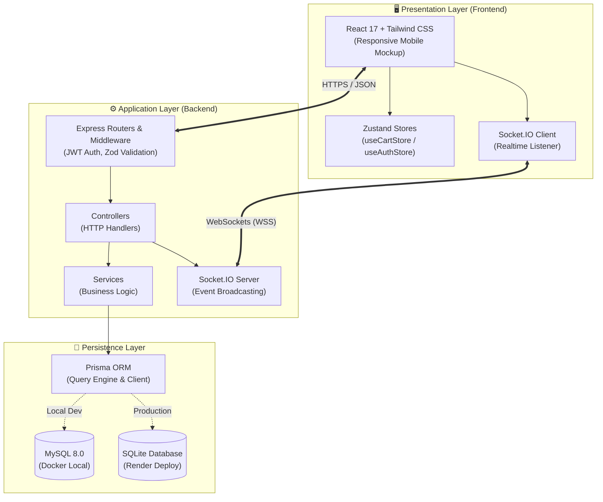

# 🍺 Docker Drinks — Full-Stack Delivery App

[](https://www.typescriptlang.org/)
[](https://nodejs.org/)
[](https://expressjs.com/)
[](https://react.dev/)
[](https://tailwindcss.com/)
[](https://www.prisma.io/)
[](https://www.mysql.com/)
[](https://www.sqlite.org/)
[](https://socket.io/)
[](https://vitest.dev/)
[](https://swagger.io/)
[](https://www.docker.com/)
[](https://opensource.org/licenses/MIT)

> 🇺🇸 **English** | 🇧🇷 [**Versão em Português**](README.md)

Modern Full-Stack beverage delivery web application featuring role-based JWT authentication (Customer, Seller, Administrator), reactive catalog state management, real-time order tracking via WebSockets, multi-database architecture with Prisma ORM, and a responsive native smartphone device frame presentation.

## 📌 Quick Navigation

- [📝 About the Project](#-about-the-project)
- [🖼️ Preview](#️-preview)
- [📱 Mobile App (Flutter)](#-mobile-app-flutter)
- [👥 Project History and Team Collaboration](#-project-history-and-team-collaboration)
- [🚀 Modernization Highlights (From Legacy to Portfolio)](#-modernization-highlights-from-legacy-to-portfolio)
- [🌐 Application Deployment](#-application-deployment)
- [⚡ API Endpoints](#-api-endpoints)
- [✨ Features](#-features)
- [🛠️ Technologies and Tools](#️-technologies-and-tools)
- [🏛️ Solution Architecture](#️-solution-architecture)
- [📁 Repository Structure](#-repository-structure)
- [💡 Technical Decisions](#-technical-decisions)
- [🚀 How to Run the Project](#-how-to-run-the-project)
- [📄 License](#-license)

## 📝 About the Project

**Docker Drinks** is a comprehensive e-commerce and logistics delivery application built with clean architecture, maintainability, and top-tier user experience at its core.

The application serves the entire beverage delivery operation: from catalog discovery and reactive cart management to seller dispatch workflows and administrator access management.

## 🖼️ Preview


## 📱 Mobile App (Flutter)

In addition to this Web version, this ecosystem features a **100% native mobile application built with Flutter** for Android and iOS, consuming the exact same production API with state management powered by Riverpod, instant catalog search, and real-time WebSocket order tracking:

👉 Mobile App Repository: [**github.com/ludson96/delivery_app**](https://github.com/ludson96/delivery_app)

## 👥 Project History and Team Collaboration

The project originally originated as a collaborative group challenge (team of 5 students) during the software engineering program at **Trybe**.

During this initial foundation phase:
- I was co-responsible alongside [Lucas Israel](https://github.com/Lucas-Israel) for the entire back-end development, from initial MSC architecture setup to REST routes and request controllers;
- I designed and implemented all automated test suites, covering both back-end and front-end;
- Other application requirements were developed collaboratively through `pair programming` and agile teamwork sessions.

## 🚀 Modernization Highlights (From Legacy to Portfolio)

To elevate this application into an enterprise-grade showcase for engineering portfolios, the repository underwent an extensive ground-up modernization and complete dissociation from bootcamp evaluation scripts:

| Aspect | Legacy Codebase | Modernized Architecture (Current) |
| :--- | :--- | :--- |
| **Language** | Plain JavaScript (ES6) | **TypeScript 5.3 (Full-Stack)** with rigorous end-to-end static typing across 100% of the codebase |
| **ORM / Database** | Sequelize with rigid MySQL | **Prisma ORM 5.10 with Dual-Database Engine** (MySQL via Docker locally & SQLite on Render) |
| **Database Transactions** | Operations without atomic locks | **Safe atomic transactions** using `prisma.$transaction` for resilient order placement |
| **State Management** | React Context API with excessive re-renders | **Zustand 5.0** featuring synchronized `localStorage` persistence and fine-grained subscriptions |
| **Data Synchronization** | Traditional HTTP polling | **Native WebSockets with Socket.IO** pushing instantaneous live order status updates |
| **Styling & Design** | Pure CSS / Basic SASS | **Tailwind CSS 3.4** with customized design system tokens, micro-interactions, and premium theme |
| **User Experience** | Plain desktop web interface | **Interactive Smartphone Bezel Mockup** with status bar and notch, fully fullscreen on real phones |
| **Testing Suite** | Mocha, Chai, Sinon, and Jest | **Vitest 1.3** delivering blazing-fast execution unified across both backend and frontend |
| **API Documentation** | Manual static documentation | **Interactive Swagger UI / OpenAPI 3.0** documentation served at `/api-docs` |
| **Deploy & CI/CD** | Local execution only | **Vercel** (Frontend with SPA rewrite routing) and **Render** (Autonomous SQLite backend) |
| **Legacy Cleanup** | Course evaluator files and `data-testid` | Stripped all course artifacts (`data-testids.txt`, `prototype.fig`, `pm2`, `nyc`, and dead configs) |

## 🌐 Application Deployment

Access the live production app:
👉 **[Docker Drinks Web App](https://docker-drinks.vercel.app)**

Mobile Version (Flutter):
👉 **[Flutter Mobile App Repository](https://github.com/ludson96/delivery_app)**

Interactive OpenAPI / Swagger Documentation:
👉 **[Swagger OpenAPI Docs](https://project-delivery-app-d284.onrender.com/api-docs)**

## ⚡ API Endpoints

The API strictly adheres to RESTful standards, validates payloads using declarative schemas, and secures endpoints using JWT tokens and role authorizations:

| Method | Route | Auth / Role | Description |
| :--- | :--- | :--- | :--- |
| `POST` | `/login` | Public | Authenticates user credentials and returns a signed JWT token |
| `POST` | `/register` | Public | Self-registration for new customers |
| `GET` | `/products` | Public | Retrieves all catalog products with prices and image URLs |
| `POST` | `/sales` | `Bearer Token` (Customer) | Places a new order with items and delivery address |
| `GET` | `/sales` | `Bearer Token` (All) | Lists user or seller orders according to credentials |
| `GET` | `/sales/:id` | `Bearer Token` (All) | Fetches complete order details and item breakdowns |
| `PATCH` | `/sales/:id/status` | `Bearer Token` (Seller / Customer) | Updates order status and emits WebSocket event |
| `GET` | `/admin/manager` | `Bearer Token` (Admin) | Lists all registered accounts in the system |
| `GET` | `/health` | Public | Liveness and health check endpoint |

## ✨ Features

### 👤 Customer Experience
- **Secure Authentication**: Instant login and registration with real-time feedback.
- **Interactive Catalog**: Seamless item browsing with quantity adjustments (+ / -) and custom numerical inputs.
- **Reactive Cart**: Navbar item counter badge with active tab indicator, LocalStorage sync, and automated total calculation.
- **Streamlined Checkout**: Clear delivery details input, validation, and vertical order summary.
- **Order Tracking**: Order history with live order status updates pushed via WebSockets.

### 🚚 Seller Management
- **Order Dispatch Dashboard**: Central view of orders assigned to the distributor.
- **Status Lifecycle Control**: Smooth transitions through stages (`Pending` ➔ `Preparing` ➔ `In Transit` ➔ `Delivered`).

### ⚙️ Admin Administration
- **Access Governance**: Consolidated oversight of all registered users and roles (`customer`, `seller`, `administrator`).

## 🛠️ Technologies and Tools

| Layer / Purpose | Technology | Description |
| :--- | :--- | :--- |
| **Primary Language** | **TypeScript 5.3** | End-to-end static typing eliminating runtime pitfalls |
| **Runtime Environment** | **Node.js 20.x** | High-performance asynchronous JavaScript engine |
| **Backend Framework** | **Express 4.19** | Minimalist web framework for building performant REST APIs |
| **Data Persistence** | **Prisma ORM 5.10** | Type-safe queries, automated migrations, and multi-provider schemas |
| **Databases** | **MySQL 8.0 & SQLite** | Local MySQL container orchestration and cloud-ready SQLite |
| **Schema Validation** | **Zod 3.22** | Declarative runtime validation and inferred type definitions |
| **Realtime Communication** | **Socket.IO 4.7** | Bidirectional WebSocket engine for real-time order state events |
| **User Interface** | **React 17 & Hooks** | Modular component architecture with optimized state hooks |
| **State Management** | **Zustand 5.0** | Lightweight, boilerplate-free state store with persistent sync |
| **Styling** | **Tailwind CSS 3.4** | Utility-first responsive design system with custom palette |
| **API Documentation** | **Swagger UI / OpenAPI 3** | Interactive browser documentation for all API routes |
| **Automated Testing** | **Vitest 1.3** | Blazing-fast unit testing suite with coverage reporting |
| **Containerization** | **Docker & Docker Compose** | Isolated and reproducible local development database |
| **Hosting & CI/CD** | **Vercel & Render** | Automated Git-integrated pipelines for web frontend and backend |

## 🏛️ Solution Architecture

The application adopts standard separation of concerns with layered Controller-Service-Data architecture:



## 📁 Repository Structure

```text
project-delivery-app/
├── backend/
│   ├── prisma/
│   │   ├── schema.mysql.prisma   # Prisma schema configured for MySQL
│   │   ├── schema.sqlite.prisma  # Prisma schema configured for SQLite
│   │   ├── seed.ts               # Database seeder with mock users & catalog
│   │   └── setup-db.ts           # Dual-database auto-provisioning script
│   ├── src/
│   │   ├── api/                  # Express setup, HTTP server & Socket.IO
│   │   ├── auth/                 # JWT sign/verify and password hashing
│   │   ├── controllers/          # HTTP request/response handlers
│   │   ├── docs/                 # Swagger OpenAPI 3 configuration
│   │   ├── middlewares/          # Zod validator and auth guards
│   │   ├── routers/              # Express routing definitions & OpenAPI tags
│   │   ├── services/             # Core business rules & Prisma transactions
│   │   └── tests/                # Unit test suites using Vitest
│   ├── Dockerfile
│   └── package.json
├── frontend/
│   ├── public/                   # Favicons, assets and HTML template
│   ├── src/
│   │   ├── components/           # Reusable UI components (Navbar, Frame, Cards)
│   │   ├── images/               # Docker Drinks brand logos & backgrounds
│   │   ├── pages/                # Screens (Login, Register, Products, Checkout, Orders)
│   │   ├── store/                # Zustand state stores
│   │   ├── types/                # Shared TypeScript definitions
│   │   ├── App.tsx               # Route declarations & smartphone bezel mockup
│   │   └── index.css             # Tailwind CSS tokens
│   ├── vercel.json               # SPA routing rewrite rule for Vercel
│   └── package.json
├── docs/
│   └── images/
│       └── projeto.gif           # Animated preview showcase
├── docker-compose.yml            # Local MySQL container orchestration
└── package.json                  # Root monorepo scripts
```

## 💡 Technical Decisions

1. **Dual-Database Architecture (MySQL & SQLite with Prisma)**:
   - In local development, engineers benefit from high-parity relational constraints using MySQL 8.0 via Docker.
   - On free cloud tiers like Render, managed DB instances frequently expire or sleep. The `backend/prisma/setup-db.ts` script detects environment variables and configures Prisma for SQLite on the fly, delivering zero-cost and 100% reliable cloud deployments.

2. **Zustand over Redux / Context API**:
   - Drastically reduces boilerplate while preserving granular render subscriptions and zero performance bottlenecks.
   - Enhanced with `use-sync-external-store/shim` for seamless React 17 support and reliable LocalStorage synchronization.

3. **Smartphone Device Frame for Portfolio Presentation**:
   - Technical recruiters predominantly evaluate portfolios on desktop displays. To deliver an authentic mobile delivery app feel without requiring the evaluator to toggle browser developer tools, the application embeds a realistic smartphone frame with a status bar on large screens, while seamlessly filling 100% of the viewport on real mobile devices.

4. **Native WebSockets with Socket.IO**:
   - Eliminates redundant polling intervals. As soon as a seller changes an order's status, the customer's interface updates reactively with zero page reloads.

## 🚀 How to Run the Project

### Prerequisites
- [Node.js](https://nodejs.org/) (v18 or higher recommended)
- [Docker](https://www.docker.com/) and Docker Compose installed
- [Git](https://git-scm.com/)

### 1. Clone the Repository
```bash
git clone https://github.com/ludson96/project-delivery-app.git
cd project-delivery-app
```

### 2. Start Database with Docker
Run the isolated MySQL instance:
```bash
docker-compose up -d
```

### 3. Setup and Run Backend
In a terminal, install dependencies, provision the schema, and start the development server:
```bash
cd backend
npm install
npm run db:setup
npm run dev
```
The server will be available at `http://localhost:3001` and interactive Swagger docs at `http://localhost:3001/api-docs`.

### 4. Start Frontend
In another terminal, start the React application:
```bash
cd frontend
npm install
npm start
```
Open your browser at `http://localhost:3000`.

### 5. Run Automated Tests
```bash
# Run backend test suite
npm run test:backend

# Run project linter
npm run lint
```

## 📄 License

This project is open-source and licensed under the terms of the **MIT** License. See the [LICENSE](LICENSE) file for more information.

<div align="center">
  Developed by <strong>Ludson Pereira dos Santos</strong> 🚀<br />
  <a href="https://www.linkedin.com/in/ludson96/">LinkedIn</a> • <a href="https://github.com/ludson96">GitHub</a> • <a href="mailto:ludson_ps27@hotmail.com">Email</a>
</div>
