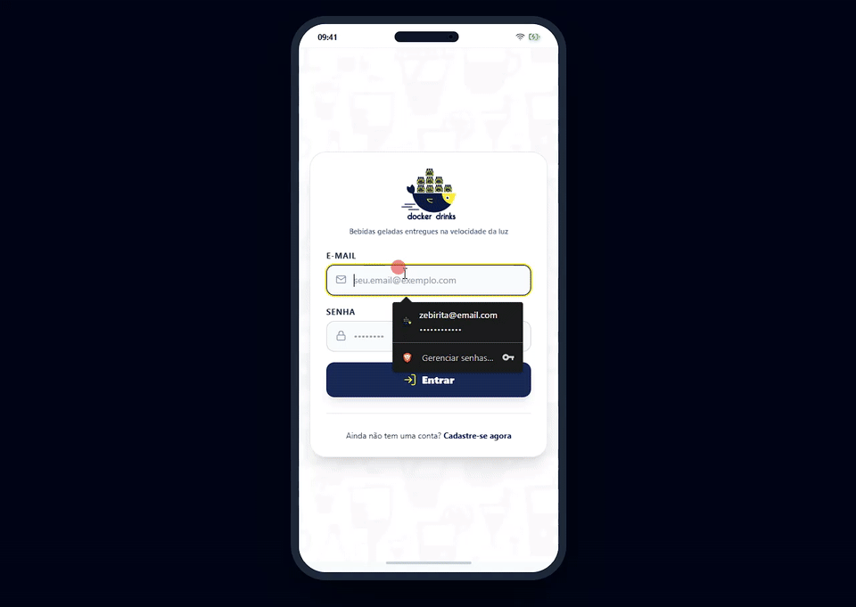
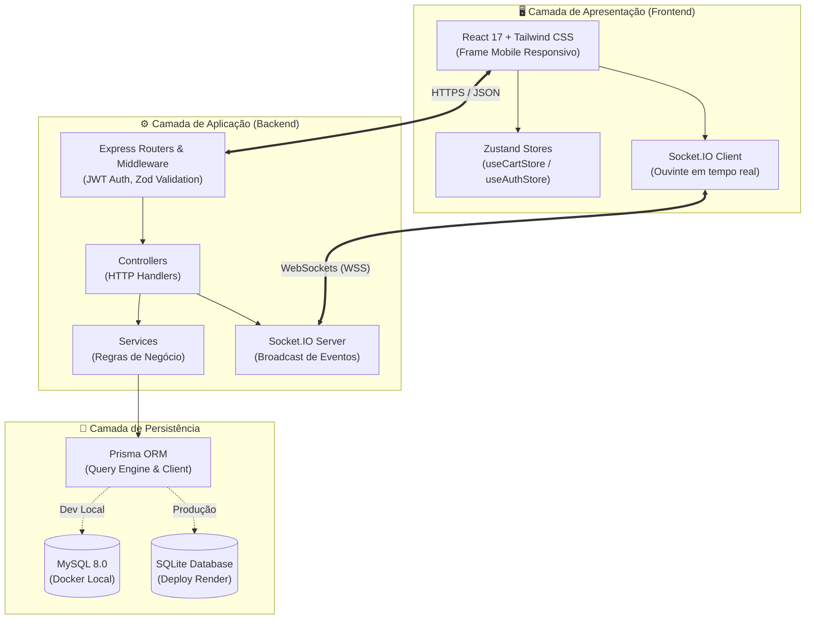

# 🍺 Docker Drinks — Delivery App Full-Stack

[](https://www.typescriptlang.org/)
[](https://nodejs.org/)
[](https://react.dev/)
[](https://tailwindcss.com/)
[](https://www.prisma.io/)
[](https://www.mysql.com/)
[](https://www.sqlite.org/)
[](https://socket.io/)
[](https://vitest.dev/)
[](https://swagger.io/)
[](https://www.docker.com/)
[](https://opensource.org/licenses/MIT)

> 🇧🇷 **Português** | 🇺🇸 [**English Version**](README.en.md)

Aplicação Full-Stack moderna para delivery de bebidas com autenticação JWT baseada em papéis (Cliente, Vendedor, Administrador), catálogo de produtos com gerenciamento reativo de estado, acompanhamento de pedidos em tempo real com WebSockets, arquitetura multi-banco com Prisma ORM e interface responsiva com layout mobile frame nativo.

## 📌 Navegação Rápida

- [📝 Sobre o Projeto](#-sobre-o-projeto)
- [🖼️ Preview](#️-preview)
- [🌐 Deploy da Aplicação](#-deploy-da-aplicação)
- [⚡ API Endpoints](#-api-endpoints)
- [✨ Funcionalidades](#-funcionalidades)
- [🛠️ Tecnologias e Ferramentas Utilizadas](#️-tecnologias-e-ferramentas-utilizadas)
- [🏛️ Arquitetura da Solução](#️-arquitetura-da-solução)
- [📁 Estrutura do Repositório](#-estrutura-do-repositório)
- [💡 Decisões Técnicas](#-decisões-técnicas)
- [🚀 Como Executar o Projeto](#-como-executar-o-projeto)
- [📄 Licença](#-licença)

## 📝 Sobre o Projeto

O **Docker Drinks** é uma solução completa de e-commerce e logística de entregas concebida com foco em arquitetura limpa, manutenibilidade e experiência de usuário de alto nível.

Originalmente desenvolvido durante o curso de desenvolvimento web da Trybe e posteriormente refatorado e modernizado por completo para o portfólio profissional, o projeto evoluiu de uma stack básica para uma arquitetura enterprise:
- **TypeScript de ponta a ponta**: tipagem estática rigorosa no front-end e no back-end.
- **Prisma ORM & Dual-Database Engine**: orquestração transparente entre MySQL para desenvolvimento em container Docker e SQLite para publicação em nuvem serverless/Render sem custos de hospedagem de banco externo.
- **Gerenciamento de Estado Reativo**: carrinho persistido e reativo utilizando Zustand com sincronização instantânea.
- **Atualizações em Tempo Real**: comunicação bidirecional com Socket.IO para notificar mudanças de status dos pedidos em tempo real.
- **Design System Mobile-First**: interface personalizada com frame de smartphone interativo em monitores ultrawide/desktop e experiência nativa em dispositivos móveis.

## 🖼️ Preview

<div align="center">
  
</div>

## 🌐 Deploy da Aplicação

Acesse a aplicação em produção:
👉 **[Docker Drinks Web App](https://docker-drinks.vercel.app)**

Documentação interativa da API (Swagger):
👉 **[Swagger OpenAPI Docs](https://project-delivery-app-d284.onrender.com/api-docs)**

## ⚡ API Endpoints

A API segue padrões RESTful rigorosos, validando payloads com schemas estritos e protegendo rotas por token JWT e perfis de acesso:

| Método | Rota | Autenticação / Role | Descrição |
| :--- | :--- | :--- | :--- |
| `POST` | `/login` | Pública | Autenticação com e-mail e senha, emitindo token JWT |
| `POST` | `/register` | Pública | Auto-cadastro de novos clientes |
| `GET` | `/products` | Pública | Catálogo de produtos com preços e URLs de imagens |
| `POST` | `/sales` | `Bearer Token` (Cliente) | Criação de novo pedido com lista de itens e endereço |
| `GET` | `/sales` | `Bearer Token` (Todos) | Listagem de pedidos filtrados pelo ID e Role do usuário |
| `GET` | `/sales/:id` | `Bearer Token` (Todos) | Detalhes completos de um pedido específico |
| `PATCH` | `/sales/:id/status` | `Bearer Token` (Vendedor / Cliente) | Atualização de status e broadcast via WebSocket |
| `GET` | `/admin/manager` | `Bearer Token` (Admin) | Listagem de todos os usuários cadastrados no sistema |
| `GET` | `/health` | Pública | Verificação de disponibilidade e saúde do servidor |

## ✨ Funcionalidades

### 👤 Painel do Cliente (Customer)
- **Autenticação Segura**: Login e cadastro com validação de dados em tempo real.
- **Catálogo Interativo**: Navegação pelos produtos com controles intuitivos de quantidade (+ / -) e input numérico.
- **Carrinho Reativo**: Contador dinâmico na barra de navegação, persistência local e cálculo automático de totais.
- **Checkout Simplificado**: Seleção de endereço de entrega, validação de campos obrigatórios e resumo vertical de itens.
- **Acompanhamento de Pedidos**: Histórico de compras com data, valor e status da entrega atualizado em tempo real.

### 🚚 Painel do Vendedor (Seller)
- **Gestão de Pedidos**: Visão centralizada das vendas atribuídas à distribuidora.
- **Fluxo de Status**: Transição de etapas do pedido (`Pendente` ➔ `Preparando` ➔ `Em Trânsito` ➔ `Entregue`).

### ⚙️ Painel do Administrador (Admin)
- **Gestão de Acessos**: Visualização consolidada de todos os usuários do ecossistema e seus respectivos papéis (`customer`, `seller`, `administrator`).

## 🛠️ Tecnologias e Ferramentas Utilizadas

| Camada / Finalidade | Tecnologia | Descrição |
| :--- | :--- | :--- |
| **Linguagem Principal** | **TypeScript 5.3** | Tipagem estática fim a fim garantindo robustez e autocompletion |
| **Ambiente de Execução** | **Node.js 20.x** | Runtime JavaScript assíncrono de alta performance no backend |
| **Framework Backend** | **Express 4.19** | Servidor HTTP minimalista para construção de endpoints RESTful |
| **Persistência de Dados** | **Prisma ORM 5.10** | Type-safe query builder, migrações automatizadas e multi-provider |
| **Bancos de Dados** | **MySQL 8.0 & SQLite** | MySQL via Docker localmente e SQLite para deploy autônomo |
| **Validação de Schemas** | **Zod 3.22** | Validação declarativa de entrada de dados e geração de tipos seguros |
| **Comunicação Realtime** | **Socket.IO 4.7** | Conexão WebSocket bidirecional para atualização de status de pedidos |
| **Interface de Usuário** | **React 17 & Hooks** | Componentização modular com hooks de ciclo de vida e estado |
| **Gerenciador de Estado** | **Zustand 5.0** | State store leve, sem boilerplate e com persistência em LocalStorage |
| **Estilização** | **Tailwind CSS 3.4** | Design system utilitário com paleta customizada e responsividade |
| **Documentação da API** | **Swagger UI / OpenAPI 3** | Documentação interativa das rotas acessível via browser |
| **Testes Automatizados** | **Vitest 1.3** | Suíte de testes unitários ultrarrápida com relatórios integrados |
| **Containerização** | **Docker & Docker Compose** | Ambiente isolado e reproduzível para o banco de dados local |
| **Hospedagem & CI/CD** | **Vercel & Render** | Deploy automatizado para frontend e backend conectado ao GitHub |

## 🏛️ Arquitetura da Solução

O sistema foi estruturado seguindo os princípios de separação de responsabilidades e arquitetura em camadas (Controller-Service-Data):



## 📁 Estrutura do Repositório

```text
project-delivery-app/
├── backend/
│   ├── prisma/
│   │   ├── schema.mysql.prisma   # Schema Prisma configurado para MySQL
│   │   ├── schema.sqlite.prisma  # Schema Prisma configurado para SQLite
│   │   ├── seed.ts               # Script para popular usuários e catálogo inicial
│   │   └── setup-db.ts           # Orquestrador automático de dual-database
│   ├── src/
│   │   ├── api/                  # Configuração do Express, HTTP Server e Socket.IO
│   │   ├── auth/                 # Utilitários de JWT e criptografia de senhas
│   │   ├── controllers/          # Manipuladores de requisições e respostas HTTP
│   │   ├── docs/                 # Definição e configuração do Swagger OpenAPI 3
│   │   ├── middlewares/          # Validação com Zod e autenticação por Token
│   │   ├── routers/              # Definição das rotas e anotações OpenAPI
│   │   ├── services/             # Regras de negócio e integração com Prisma
│   │   └── tests/                # Testes unitários com Vitest
│   ├── Dockerfile
│   └── package.json
├── frontend/
│   ├── public/                   # Favicons, assets estáticos e template HTML
│   ├── src/
│   │   ├── components/           # Componentes reutilizáveis (Navbar, Frame, Cards)
│   │   ├── images/               # Logos da marca Docker Drinks e background
│   │   ├── pages/                # Telas (Login, Register, Products, Checkout, Orders)
│   │   ├── store/                # Gerenciadores de estado com Zustand
│   │   ├── types/                # Definições de tipos TypeScript compartilhados
│   │   ├── App.tsx               # Roteamento e dispositivo smartphone mockup
│   │   └── index.css             # Configurações do Tailwind CSS
│   ├── vercel.json               # Configurações de redirecionamento SPA para Vercel
│   └── package.json
├── docs/
│   └── images/
│       └── projeto.gif           # Demonstração animada da interface
├── docker-compose.yml            # Orquestração do MySQL para desenvolvimento
└── package.json                  # Scripts unificados de gerenciamento na raiz
```

## 💡 Decisões Técnicas

1. **Estratégia Dual-Database (MySQL & SQLite com Prisma)**:
   - Em desenvolvimento local, o time se beneficia da fidelidade de um banco relacional corporativo (MySQL 8.0 rodando via Docker).
   - Em produção no Render (plano gratuito), instâncias gerenciadas de banco de dados expiram com frequência. O script `backend/prisma/setup-db.ts` detecta a variável de ambiente e chaveia transparentemente o schema para SQLite, permitindo deploy contínuo, seguro e com zero custo operacional.

2. **Adoção do Zustand sobre Context API / Redux**:
   - Elimina o boilerplate excessivo do Redux mantendo performance imbatível e isolando re-renderizações desnecessárias.
   - Integração com `use-sync-external-store/shim` para garantir compatibilidade impecável com React 17 e persistência síncrona no LocalStorage.

3. **Frame de Smartphone para Apresentação em Portfólio**:
   - Avaliadores de recrutamento costumam abrir aplicações de portfólio no computador. Para simular a experiência de um aplicativo mobile de entrega sem exigir que o avaliador abra as ferramentas de desenvolvedor do navegador, a aplicação exibe um mockup premium de smartphone com status bar nativa em telas grandes, tornando-se 100% tela cheia ao ser acessada de um celular real.

4. **WebSockets Nativos com Socket.IO**:
   - Evita polling repetitivo e sobrecarga no servidor. Quando o vendedor altera o status do pedido, o cliente recebe a notificação instantânea e o badge atualiza sem recarregar a página.

## 🚀 Como Executar o Projeto

### Pré-requisitos
- [Node.js](https://nodejs.org/) versão 18 ou superior
- [Docker](https://www.docker.com/) e Docker Compose instalados
- [Git](https://git-scm.com/)

### 1. Clonar o Repositório
```bash
git clone https://github.com/ludson96/project-delivery-app.git
cd project-delivery-app
```

### 2. Subir o Banco de Dados com Docker
Inicie a instância do MySQL em container isolado:
```bash
docker-compose up -d
```

### 3. Configurar e Iniciar o Backend
Abra um terminal, acerte as dependências e inicie o servidor:
```bash
cd backend
npm install
npm run db:setup
npm run dev
```
O servidor estará disponível em `http://localhost:3001` e o Swagger em `http://localhost:3001/api-docs`.

### 4. Iniciar o Frontend
Em outro terminal, acesse a pasta do frontend e inicie a interface:
```bash
cd frontend
npm install
npm start
```
Acesse no seu navegador: `http://localhost:3000`.

### 5. Executar os Testes Automatizados
```bash
# Rodar testes do backend
npm run test:backend

# Rodar linter em todo o projeto
npm run lint
```

## 📄 Licença

Este projeto está licenciado sob os termos da licença **MIT**. Consulte o arquivo [LICENSE](LICENSE) para mais detalhes.

<div align="center">
  Desenvolvido por <strong>Ludson Pereira dos Santos</strong> 🚀<br />
  <a href="https://www.linkedin.com/in/ludson96/">LinkedIn</a> • <a href="https://github.com/ludson96">GitHub</a> • <a href="mailto:ludson_ps27@hotmail.com">E-mail</a>
</div>
